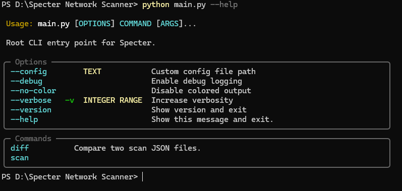
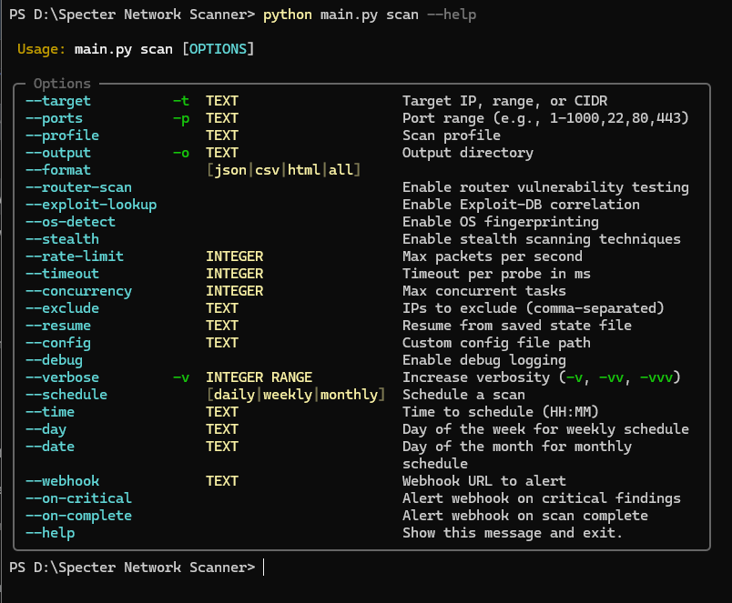
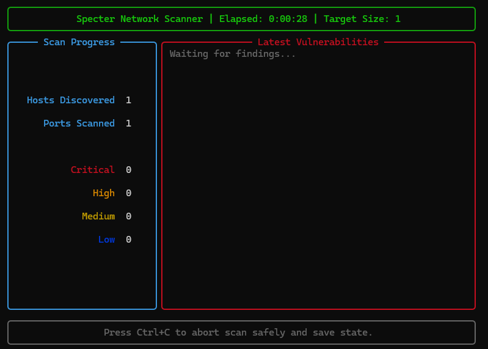
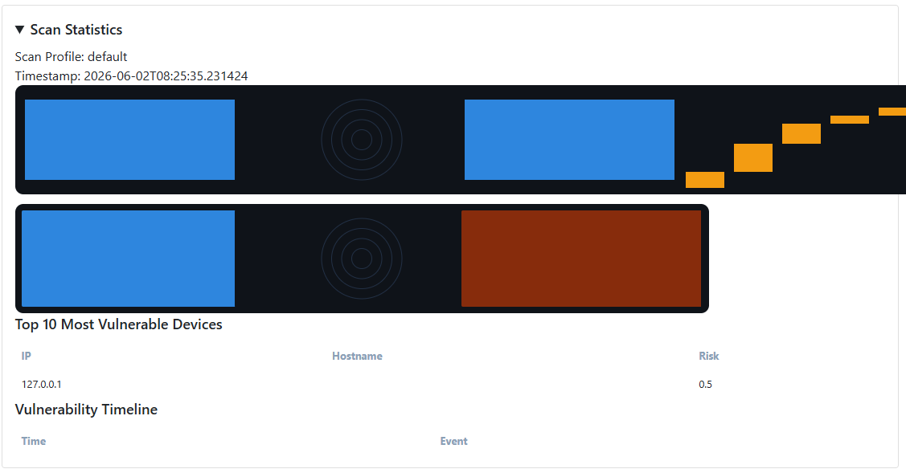

# Specter Network Scanner 


A high-performance, asynchronous network reconnaissance tool with service detection, exploit correlation, and interactive reporting.

##  Features
-  **Async Scanning**: High-speed discovery and scanning with built-in rate limiting.
- **Network Discovery & OS Fingerprinting**: Accurately identify devices and their operating systems on the network.
-  **Exploit-DB Correlation**: Automatically cross-reference discovered services with known vulnerabilities.
-  **Interactive HTML Reporting**: Generate clean, easy-to-read reports for stakeholders.
-  **Router Fingerprinting & Safety Controls**: Intelligent controls to prevent disrupting fragile network equipment.

##  Installation

You can install Specter Network Scanner using your preferred method.

### Method 1: Pip (Recommended)
```bash
git clone https://github.com/YOUR_USERNAME/specter-network-scanner.git
cd specter-network-scanner
python -m venv .venv
. .venv/bin/activate  # On Windows use: .venv\Scripts\activate
pip install -r requirements.txt
```

### Method 2: Docker
```bash
docker build -t specter .
docker run --rm --network host specter scan -t 127.0.0.1
```

##  Usage

### Basic Commands

**Scan a single target:**
```bash
python main.py scan -t 127.0.0.1
```

**Scan a specific subnet and output an HTML report:**
```bash
python main.py scan -t 192.168.1.0/24 -o ./reports --format html
```

**Scan specific ports on a target:**
```bash
python main.py scan -t 192.168.1.10 -p 22,80,443,8080 --profile standard
```

**Enable OS detection and exploit lookup:**
```bash
python main.py scan -t 192.168.1.0/24 --os-detect --exploit-lookup
```

##  Screenshots


*Main CLI help menu showing available commands*


*Detailed help for the scan command and its options*


*Real-time scanning progress dashboard*


*Generated interactive HTML report*

##  Configuration

See `docs/configuration.md` for the full YAML reference.

##  Legal and Ethical Use

Specter is intended for **authorized security testing only**. Do not scan systems you do not own or do not have explicit permission to test.

##  Contributing

Contributions are welcome! See `docs/contributing.md` for details.
